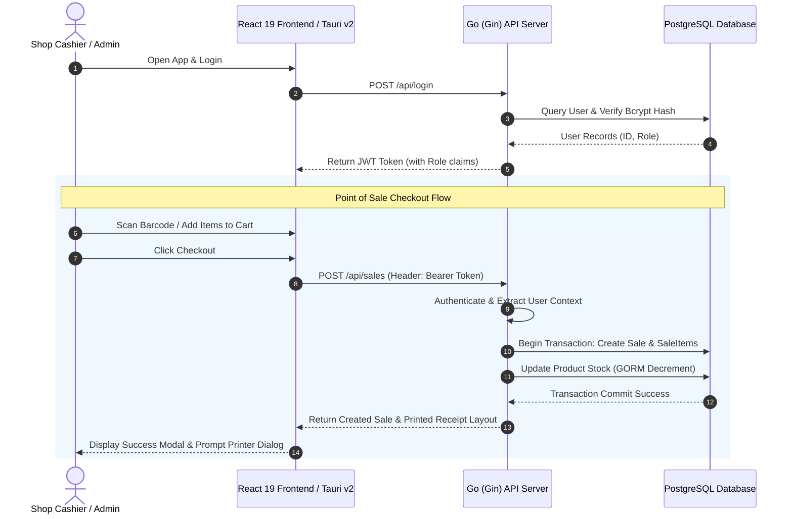

# 🏪 Household Shop POS

[](https://golang.org)
[](https://react.dev)
[](https://tauri.app)
[](https://tailwindcss.com)
[](https://www.postgresql.org)
[](./frontend/src/i18n.ts)

A premium, modern, and production-ready **Point of Sale (POS) & Retail Management System** designed for household shops and retail businesses. Combining a blazing-fast, secure **Go (Gin) backend** with a stunning **React 19 & Tailwind CSS v4 frontend**, the application is fully wrapped as a lightweight native desktop application using **Tauri v2**. 

With advanced real-time barcode scanning, localized multi-lingual support, automatic receipt generation, role-based access control, and low-stock indicators, Household Shop POS empowers shop owners to digitize their operations effortlessly.

---

## ✨ Features at a Glance

### 🖥️ 1. Ultra-Modern Responsive Dashboard & Navigation
- **Live Statistics Cards**: Track Total Sales Count, Total Products, Today's Revenue, and All-Time Cumulative Revenue at a glance.
- **Recent Transactions Stream**: Instantly loaded list of the latest 5 transactions, showing timestamps and the cashiers responsible.
- **Actionable Low Stock Alerts**: Highlights items falling below their warning threshold, prompting managers for restock.
- **Dynamic Mobile Navigation**: Custom hamburger drawer and sidebar overlay optimized for both standard PC monitors and touchscreen POS tablets.

### 🛒 2. Intuitive POS Register
- **Real-Time Barcode Scanning**: Immediate item detection via barcode scanner focus. Simply scan a barcode (e.g., `000001` or `000006`) to append to your active order basket.
- **Frictionless Cart Controls**: Incremental adjust buttons, immediate subtotal recalculations, and swift removal shortcuts.
- **Custom Print Layouts**: Modal receipt previews with inline thermal print generation styled dynamically.
- **Out of Stock Lock**: Visually disables and prevents selling products with zero inventory to avoid double-bookings.

### 📦 3. Advanced Inventory & Category Management
- **Full CRUD Operations**: Create, edit, and archive products and category catalogs dynamically.
- **Visual Product Profiles**: Unsplash CDN integration or direct URL loading for high-quality product images.
- **Custom Stock Settings**: Set per-product `Price`, `StockQuantity`, and custom `LowStockThreshold` (defaults to 5) triggering warning icons.
- **Categorization Engine**: Keeps products structured (e.g. *Beverages*, *Snacks*, *Household*) for swift filtering.

### 🔒 4. Role-Based Access Control (RBAC)
- **Role Permissions**: Secures operations into **Admin** vs. **Cashier** capabilities.
- **Protected Actions**: Prevents non-admin cashiers from modifying products, deleting users, or viewing sensitive financial margins, enforced at both the React Route level and the Gin API middleware layer.
- **User Audits**: Dynamic cashier accounts allow owners to trace sales directly back to individual cashiers.

### 🌐 5. Native Internationalization (i18n)
- **Zero-Latency Language Toggle**: Instantly translate the interface between **English (en)** and **Burmese (my)** with one click.
- **Fallback Translations**: Structured translation schemas ensure smooth, bulletproof localized layouts.

---

## 🏗️ Tech Stack

### 🚀 Backend Service
* **Language & Runtime:** Go v1.25.6
* **Web Framework:** [Gin Web Framework](https://github.com/gin-gonic/gin) for highly optimized routing and request/response serialization.
* **Database Object-Relational Mapper (ORM):** [GORM](https://gorm.io) for robust, type-safe database access, table schemas, and automatic relationships.
* **Security:** `golang.org/x/crypto` (Bcrypt) for high-entropy user password hashing and JWT token claims validation.
* **Configurations:** [godotenv](https://github.com/joho/godotenv) for clean `.env` key loading.

### 🎨 Frontend Client
* **Core & Build System:** React 19, Vite 8, TypeScript 6
* **Styling Framework:** [Tailwind CSS v4](https://tailwindcss.com) featuring modern theme variables (`@theme` imports) and dynamic micro-animations.
* **State & Router:** [React Router DOM v7](https://reactrouter.com) for secure client route-guarding.
* **Icons:** [Lucide React](https://lucide.dev) for pixel-perfect modern vector UI icons.
* **HTTP Client:** Axios with custom bearer interceptors.
* **Localization:** `i18next` & `react-i18next` for reactive Multi-language swapping.

### 📦 Desktop App Shell
* **Wrapper Framework:** [Tauri v2](https://tauri.app) to build native, secure, and lightweight executables (under ~10MB) for Windows, macOS, and Linux, replacing bloated Electron frames.

---

## 📊 System Architecture



---

## 🗄️ Database ERD (Entity Relationship Diagram)

```mermaid
erDiagram
    User ||--o{ Sale : "processes"
    Category ||--o{ Product : "contains"
    Sale ||--|{ SaleItem : "comprises"
    Product ||--o{ SaleItem : "sold_in"

    User {
        uint id PK
        string username UNIQUE
        string password
        string role "admin / cashier"
        datetime created_at
        datetime updated_at
    }

    Category {
        uint id PK
        string name UNIQUE
        string description
        datetime created_at
        datetime updated_at
    }

    Product {
        uint id PK
        string name
        uint category_id FK
        float64 price
        int stock_quantity
        int low_stock_threshold
        string image_url
        string barcode UNIQUE
        datetime created_at
        datetime updated_at
    }

    Sale {
        uint id PK
        float64 total_amount
        uint user_id FK
        datetime created_at
        datetime updated_at
    }

    SaleItem {
        uint id PK
        uint sale_id FK
        uint product_id FK
        int quantity
        float64 price
    }
```

---

## 📂 Project Structure

```bash
shop_pos/
├── backend/                  # 💻 Go Backend Directory
│   ├── config/               # Database Connection & GORM Init
│   │   └── db.go
│   ├── controllers/          # Endpoint Controllers (Business Logic)
│   │   ├── auth.go           # Registration & Login validation
│   │   ├── categories.go     # Category CRUD Handlers
│   │   ├── dashboard.go      # Statistics & Recent Transaction Calculations
│   │   ├── products.go       # Inventory CRUD & Stock Updates
│   │   ├── sales.go          # Transaction Processor (GORM Transactions)
│   │   └── users.go          # Cashier & User Account Control
│   ├── middlewares/          # JWT Middleware & Admin Guard Restrictions
│   │   └── auth.go
│   ├── models/               # GORM DB Model Definitions
│   │   └── models.go
│   ├── routes/               # API Route Group Setup
│   │   └── routes.go
│   ├── .env                  # Configuration Environment Variables
│   ├── go.mod                # Go module dependencies
│   ├── main.go               # Backend Application Entry Point
│   └── seed.go               # ⚡ DB Creation, Migration & Demo Seeding Utility
│
├── frontend/                 # 🎨 Vite + React + Tauri Frontend Directory
│   ├── src-tauri/            # 🦀 Tauri v2 Native Desktop Rust Backend Configuration
│   │   ├── capabilities/     # Desktop Window & Permission configs
│   │   ├── icons/            # App Icons for installers
│   │   ├── src/              # Rust Main file & window configurations
│   │   ├── Cargo.toml        # Rust package configuration
│   │   └── tauri.conf.json   # Desktop build and wrapper specifications
│   │
│   ├── src/                  # Web App React Root
│   │   ├── components/       # Shared Components (Sidebar, Navbar Layout)
│   │   ├── locales/          # Localization Dictionaries (English, Burmese)
│   │   │   ├── en/translation.json
│   │   │   └── my/translation.json
│   │   ├── pages/            # Core Navigation Pages
│   │   │   ├── Dashboard.tsx # Analytics Stats, Low Stock alerts, Recent Sales
│   │   │   ├── Login.tsx     # Modern responsive glassmorphism log in
│   │   │   ├── POS.tsx       # Live POS billing cart & barcode input
│   │   │   ├── Products.tsx  # Product/Category admin controllers
│   │   │   ├── Sales.tsx     # Historic transaction receipts viewer
│   │   │   └── Users.tsx     # Staff Cashier account registration panel
│   │   ├── App.css           # Global custom styled transitions
│   │   ├── App.tsx           # React Router DOM Guard routes configuration
│   │   ├── i18n.ts           # i18next Multi-language config
│   │   ├── index.css         # Tailwind v4 import & custom styling theme variables
│   │   └── main.tsx          # Client Entry point
│   │
│   ├── package.json          # Node dependencies & run scripts
│   ├── tailwind.config.js    # Additional configurations
│   └── vite.config.ts        # Vite plugins & configuration
│
└── README.md                 # Project Documentation
```

---

## 🌐 API Route Endpoint Directory

All endpoints (except Authentication) require a valid JWT token passed in the request header as `Authorization: Bearer <token>`.

| Area | Endpoint | Method | Required Role | Description |
|---|---|---|---|---|
| **Auth** | `/api/register` | `POST` | Public | Registers a new staff account |
| **Auth** | `/api/login` | `POST` | Public | Authenticates credentials, returns JWT token |
| **Dashboard** | `/api/dashboard` | `GET` | Cashier & Admin | Aggregates sales KPIs, low stock list, recent transactions |
| **Users** | `/api/users` | `GET` | **Admin Only** | Returns all registered cashier profiles |
| **Users** | `/api/users/:id` | `PUT` | **Admin Only** | Modifies user profiles (role, details) |
| **Users** | `/api/users/:id` | `DELETE` | **Admin Only** | Deletes/Removes user accounts |
| **Categories** | `/api/categories` | `GET` | Cashier & Admin | Returns active categories list |
| **Categories** | `/api/categories` | `POST` | **Admin Only** | Creates a new inventory classification |
| **Categories** | `/api/categories/:id` | `PUT` | **Admin Only** | Modifies category details |
| **Categories** | `/api/categories/:id` | `DELETE` | **Admin Only** | Deletes category catalog |
| **Products** | `/api/products` | `GET` | Cashier & Admin | Returns complete catalog of products |
| **Products** | `/api/products` | `POST` | **Admin Only** | Registers a new product SKU |
| **Products** | `/api/products/:id` | `PUT` | **Admin Only** | Updates price, stocks, or threshold |
| **Products** | `/api/products/:id` | `DELETE` | **Admin Only** | Deletes a product SKU |
| **Products** | `/api/products/:id/stock`| `PATCH` | **Admin Only** | Instantly increments/updates warehouse stock |
| **Sales** | `/api/sales` | `POST` | Cashier & Admin | Submits a cart, saves to DB, decrements stock |
| **Sales** | `/api/sales` | `GET` | Cashier & Admin | Returns complete sales ledger |
| **Sales** | `/api/sales/:id` | `GET` | Cashier & Admin | Retrieves an itemized historical receipt |

---

## ⚡ Getting Started & Installation

### Prerequisites
Make sure you have the following installed on your machine:
- **Go** (v1.25.6 or later)
- **Node.js** (v18 or later) with `npm` or `pnpm`
- **PostgreSQL** (v14 or later)
- **Rust Compiler** *(Only required if compiling/running the Tauri Desktop wrapper)*

---

### 💻 Step 1: Configure & Seed Backend Database

1. Open your PostgreSQL terminal/GUI client and make sure the server is active.
2. Navigate to the `backend/` folder:
   ```bash
   cd backend
   ```
3. Initialize the environment variable file `.env` (it is preset with standard defaults):
   ```ini
   PORT=8080
   DB_HOST=localhost
   DB_USER=postgres
   DB_PASSWORD=postgres
   DB_NAME=shop_pos
   DB_PORT=5432
   JWT_SECRET=supersecretkey
   ```
4. Run the **Automatic Database Seeding Utility**. This script will:
   - Connect to standard PostgreSQL server.
   - Automatically create the `shop_pos` database if it does not exist yet.
   - Initialize tables using GORM auto-migrations (`users`, `categories`, `products`, `sales`, `sale_items`).
   - Clear legacy data and seed demo categories (*Beverages, Snacks, Household*).
   - Seed sample products with gorgeous preset Unsplash product photos.
   - Create a default **Admin account**:
     - **Username:** `admin`
     - **Password:** `admin123`
   
   Execute the tool with:
   ```bash
   go run seed.go
   ```

5. Once seeded, start the active Go API web server:
   ```bash
   go run main.go
   ```
   The backend API will begin listening on **`http://localhost:8080`**.

---

### 🎨 Step 2: Set Up and Start Frontend

1. Navigate to the `frontend/` directory:
   ```bash
   cd ../frontend
   ```
2. Install package dependencies using `pnpm` (recommended) or `npm`:
   ```bash
   pnpm install
   # or
   npm install
   ```
3. Start the Vite React web application:
   ```bash
   pnpm dev
   # or
   npm run dev
   ```
4. Open your browser and navigate to **`http://localhost:5173`**.
5. Use the seeded credentials to log in:
   - **Username:** `admin`
   - **Password:** `admin123`

---

### 🦀 Step 3: Run as Tauri Desktop Application (Optional)

To bundle or execute this project as a native desktop application shell using Tauri v2:

1. Ensure the Rust compiler is installed on your operating system (`rustup` installer).
2. Inside the `frontend/` folder, run the Tauri dev server:
   ```bash
   pnpm tauri dev
   # or
   npx tauri dev
   ```
   Tauri will launch a native OS window displaying the React Point of Sale client interface, bypassing the need to use a browser.

3. To build a highly optimized standalone installers/packages (`.msi` / `.exe` on Windows, `.dmg` / `.app` on macOS, `.deb` on Linux):
   ```bash
   pnpm tauri build
   # or
   npx tauri build
   ```
   Installers will be generated under the `frontend/src-tauri/target/release/bundle/` directory.

---

## 🛠️ Developer Customization Guide

### 🧬 Adding a Database Table / Model
1. Open the [models.go](./backend/models/models.go) file.
2. Add your struct definition utilizing GORM tags:
   ```go
   type Supplier struct {
       ID        uint      `gorm:"primaryKey" json:"id"`
       Name      string    `gorm:"not null" json:"name"`
       Phone     string    `json:"phone"`
       CreatedAt time.Time `json:"created_at"`
   }
   ```
3. Register the new model in the GORM Auto-Migration call located in [main.go](./backend/main.go#L26):
   ```go
   config.DB.AutoMigrate(&models.User{}, &models.Category{}, &models.Product{}, &models.Sale{}, &models.SaleItem{}, &models.Supplier{})
   ```
4. Perform the same addition inside `seed.go` to ensure migrations work smoothly during database setup.

### 🌐 Extending Internationalization Translations
To append new visual keywords or translate existing terms into additional languages:
1. Open the English translation catalog at [en/translation.json](./frontend/src/locales/en/translation.json).
2. Append your key-value pairs:
   ```json
   "translation": {
     "welcome": "Welcome back",
     "checkout": "Checkout"
   }
   ```
3. Open the Burmese dictionary at [my/translation.json](./frontend/src/locales/my/translation.json) and add the matching Burmese terms.
4. Render the translation on any frontend page by calling the `useTranslation()` React hook:
   ```tsx
   import { useTranslation } from 'react-i18next';
   
   const MyComponent = () => {
     const { t } = useTranslation();
     return <h1>{t('welcome')}</h1>;
   };
   ```

---

## 🤝 Contributing
Contributions are what make the open source community such an amazing place to learn, inspire, and create. Any contributions you make are **greatly appreciated**.

1. Fork the Project
2. Create your Feature Branch (`git checkout -b feature/AmazingFeature`)
3. Commit your Changes (`git commit -m 'Add some AmazingFeature'`)
4. Push to the Branch (`git push origin feature/AmazingFeature`)
5. Open a Pull Request

---

## 📄 License
Distributed under the MIT License. See `LICENSE` for more information.

---

*Made with ❤️ by the Household Shop POS Developer Team.*